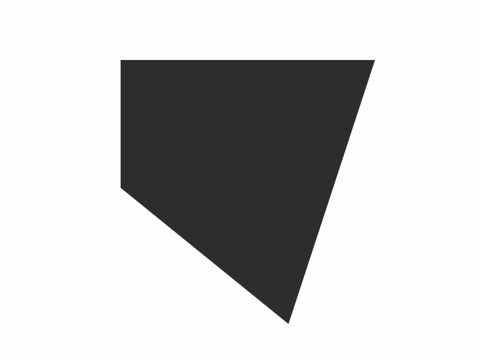

While Processing is my usual tool of choice for generative graphics, I wanted to make something that could be easily shared and Canvas seemed like the most reasonable choice for this project. The next step was to port the original Nervous Polygon sketch from Processing to Canvas. This also helped me get familiar with the technology. 

The polygon is made up of 5 nodes. When the mouse is clicked, each node receives a new target location and then eases to that position at a pre-determined velocity. 



```
var Node = function(pos, domain, dir) {
	this.pos = pos;
	this.domain = domain;
	this.dir = dir; // True x axis, False y axis
	this.delay = 16;
};

Node.prototype.shift = function() {
	var nX, nY;
	if(this.dir) {
		nX = this.domain[0] + Math.random()*this.domain[1];
		nY = this.pos.y;
	} else {
		nX = this.pos.x;
		nY = this.domain[0] + Math.random()*this.domain[1];
	}
	this.target = new b2Vec2(nX, nY);
};

Node.prototype.update = function() {
	if(this.target) {
  	this.pos.x += (this.target.x-this.pos.x)/this.delay;
  	this.pos.y += (this.target.y-this.pos.y)/this.delay;
  }
};
```

```
var Polygon = function(nodes, col, bg, w, h) {
	this.nodes = nodes;
	this.col = col;
	this.bg = bg;
	this.w = w;
	this.h = h;
};

Polygon.prototype.impulse = function () {
	for (var i = this.nodes.length - 1; i >= 0; i--) {
		this.nodes[i].shift();
	};
};
```
