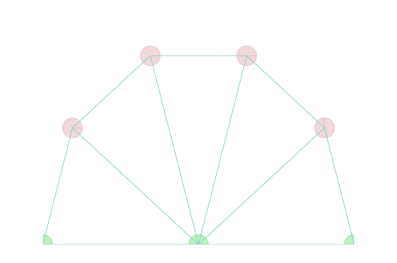

I wanted to play around with the idea of springy membranes. This was particularly inspired by the [Red Curve Relief](http://1.bp.blogspot.com/-h8vIARrJHTI/TVgr1IHdJbI/AAAAAAAADZM/eF_8iRYRX08/s1600/43b6c106.jpg) artwork by Ellsworth Kelly. 

To do so, I had two options:

- Use easing functions to replicate springy movements
- Use a physics engine to create a skeleton and add organic movements

I see these shapes as animated creatures, so I chose the latter. The skeleton is made up of particles and spring-links.

The bottom three particles are anchors. The remaining are dynamic particles connected to the anchors and adjacent particles using springs.

On mouse click, a short impulse is applied to the dynamic particles, causing them to oscillate in a fairly organic motion. 

