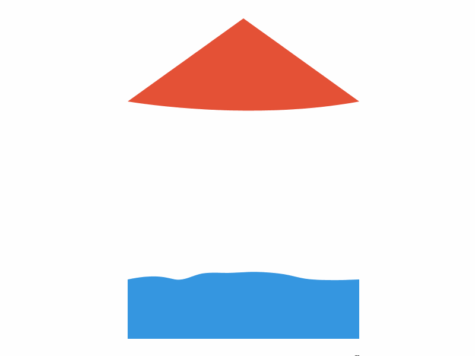

Image source: [parkettart.com](http://www.parkettart.com/archive/56-archive-kelly.html)

Continuing my fascination with these springy membranes, I converted more of Kelly's artworks into Canvas-based animations. This phase included artworks such as  [Untitled](http://www.tate.org.uk/art/artworks/kelly-no-title-p20160), which consist of a triangular shape with two straight edges and one curved one. 

The principal remained the same: anchored particles and dynamic particles connected by springs. The Curved portion was created using simple [Bezier Curves](http://en.wikipedia.org/wiki/B%C3%A9zier_curve).

I also played around with the idea of chaining multiple bezier curves, as demonstrated by the blue section below:

