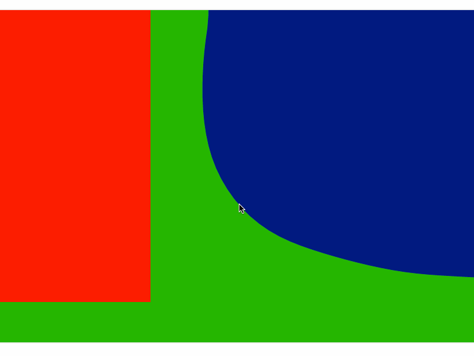

For the [Red Blue Green](http://www.wikipaintings.org/en/ellsworth-kelly/red-blue-green-1963) artwork I wanted to play around with the interface of the green and blue areas. To do so I turned that interface into a rope:

This rope is provided with a slight amount of tension. This tension is then relieved on page-load; causing the rope to float around and animate the shapes.

The viewer can also grab the interface of the green-blue area and give it momentum. 

